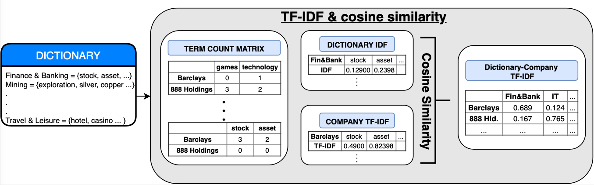

# Search-tool-for-Similar-Companies
The project was created by University of Manchester and PEAK AI Manchester.

## Introduction
Nowadays many companies spend a great amount of time on searching for similar business for market analysis or investment purposes. It was until recently, when it was proposed to use machine learning and deep learning techniques to implement this process in easier and more efficient way.

This particular project focuses on scraping the textual data from all the official financial website such as FT, Telegraph or London Stock Exchange. Then we used deep learning technique to find similar companies to a particular company (search 1) and used machine learning technique to find the similar companies within an industry (search 2).

For search 1 we have decided to use the Doc2vec embeddings, which is famous for paragraph embedding. For a second search, we have used the machine learning technique TFIDF to find the similar companies within an industry, which is predefined by our dictionaries. The process of second search is shown in the following picture.



## Getting Started
The code attached in this file contain the code for search tool including search 1 and search 2. The code is written in python and is dependant on libraries:

```
numpy
nltk
gensim
```

The data are scraped and prepared for running the training. The dictionary of industries was created based on the most frequent words excluding the stopwords.

## Running the Codes
We can now run the main code
```
searchtool.py
```
Because it takes time to train the doc2vec model, the program will run the training for the first time and save this trained model for next use. It takes about 10 min to train the data for 1417 companies on UK stock market.

## Results
```
Is this you first time using this tool?

[y/n]:n
Loading the model ...

Which search do u wish to turn on? 1 for company search, 2 for sector search:1

Company name:888 

Do you mean: 888 Holdings?[y/n]y

Do you want to narrow down the search by company size?[y/n]y
ddd

Please enter the lower bound for size (in millions):10

Please enter the upper bound for size (in millions):100

How many companies do you want to find? Enter number:10
Search: 888 Holdings,  Market Capital: 600.16
                          Similar_company  MarketCap
121                  Greencoat Renewables      92.95
128                          Mysale Group      49.46
146                           MobilityOne      40.52
224                           GLI Finance      53.83
237           Pennant International Group      87.20
364                         Admiral Group      88.80
368                      HG Capital Trust      99.99
384                 Begbies Traynor Group      91.20
468  Funding Circle Holdings  Ord 0.1p Wi      76.18
538                        Coral Products      73.33

Do you wish to start another search?
```
As we can see, before the program finds the similar companies with search 1, we can further filter the selected companies by market capital and number of most similar companies to a company.

```
Do you wish to start another search?

[y/n]:y

Which search do u wish to turn on? 1 for company search, 2 for sector search:2

Type any keywords for to define the company activities or company products: bank
The keywords "bank", were found under sector "Finance & Banking". The companies defined with these keywords are shown below.
0                                       3i Infrastructure
3                              Aberdeen Asian Income Fund
5       Aberdeen Asian Smaller Companies Investment Trust
9            Aberdeen Diversified Income And Growth Trust
11        Alcentra European Floating Rate Income Fund Red
20           Aberdeen New India Investment Trust  Ord 25p
23                                      Apax Global Alpha
24                                     Arrow Global Group
25                   Asa International Group  Ord Gbp1 Wi
27      ABERDEEN STANDARD EQUITY INCOME TRUST PLC ORD 25P
29                     Aberforth Split Level Income Trust
32               Schroder Asian Total Return Inv. Company
33                                    Artemis Alpha Trust
34                                         Alliance Trust
35                      Allianz Technology Trust  Ord 25p
50                                    BB Healthcare Trust
54      BMO CAPITAL & INCOME INVESTMENT TRUST PLC ORD 25P
59                            Baillie Gifford Shin Nippon
60               BMO GLOBAL SMALLER COMPANIES PLC ORD 25P
61                Baillie Gifford Uk Growth Fund  Ord 25p
62                                  BH Global Limited GBP
63                                   BH Macro Limited GBP
66                                           Biotech Gwth
71                       Bankers' Investment Trust  (the)
77                    BMO PRIVATE EQUITY TRUST PLC ORD 1P
79                   Blackrock Frontiers Investment Trust
80                     Blackrock Greater Europe Inv Trust
81                                     BlackRock Latin Am
82                                   BlackRock North Amer
83                      BlackRock Smaller Companies Trust
                       ...
654                                   AFH Financial Group
697                                            Argo Group
716                                 B.P. Marsh & Partners
787                  Cip Merchant Capital Limited Ord Npv
812                     Craven House Capital  ORD USD1.00
817                            Crystal Amber Fund Limited
841                                  Duke Royalty Limited
869                             EPE Special Opportunities
899                                  First Property Group
931                                           GLI Finance
945                               Gresham House Strategic
948                                    Gunsynd  Ord 0.01p
950                                             H&T Group
954                       Harwood Wealth Management Group
956                                   Helios Underwriting
1055                                 Manx Financial Group
1057                                    Marechale Capital
1065                               Metal Tiger  Ord 0.01p
1078                                          Miton Group
1114                                    Numis Corporation
1118                                            Octagonal
1129                                       Origo Partners
1145                                            PCF Group
1167                               Polar Capital Holdings
1175                       Premier Asset Management Group
1223                                     Rosenblatt Group
1231                                             Safeland
1389                         Weiss Korea Opportunity Fund
1400                             Yellow Cake  Ord Gbp0.01
1401                          Yolo Leisure And Technology
Name: Name, Length: 195, dtype: object
Do you wish to start another search?

[y/n]:n
```
The program then runs until we choose to close the search.


